# Rust_Lang_GPT

[](https://www.rust-lang.org/)
[](https://opensource.org/licenses/MIT)
[](https://github.com/danindiana/Rust_Lang_GPT)
[](https://github.com/danindiana/Rust_Lang_GPT/stargazers)
[](https://github.com/danindiana/Rust_Lang_GPT/network)
[](https://github.com/danindiana/Rust_Lang_GPT/issues)

A comprehensive collection of Rust programs demonstrating various concepts, from basic file operations to advanced concurrent web crawling and data processing. These programs showcase Rust's capabilities in systems programming, async I/O, parallel processing, and network operations.

## Table of Contents

- [Overview](#overview)
- [Git Workflow](#git-workflow)
- [Repository Structure](#repository-structure)
- [Project Categories](#project-categories)
- [Technology Stack](#technology-stack)
- [Getting Started](#getting-started)

## Overview

This repository contains a curated collection of Rust programs exploring various domains:
- **Web Crawling & Scraping**: Multiple implementations using different concurrency models
- **File Operations**: Search, hash verification, and file management utilities
- **Network Programming**: DNS enumeration, TCP servers, and domain brute-forcing
- **Concurrent Programming**: Examples using Tokio (async) and Rayon (data parallelism)
- **Data Processing**: Word counting, PDF processing, and document indexing

## Git Workflow

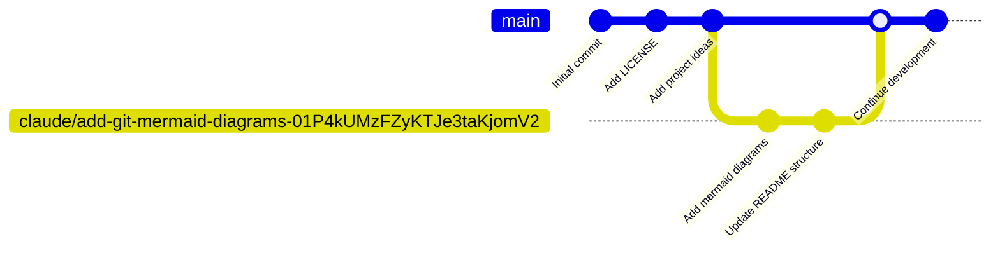

### Branch Strategy

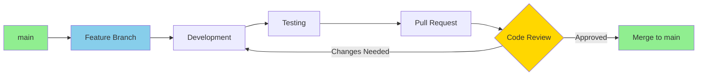

## Repository Structure

```mermaid
graph TD
    A[Rust_Lang_GPT] --> B[Web Crawlers]
    A --> C[File Operations]
    A --> D[Network Tools]
    A --> E[Concurrent Processing]
    A --> F[Utilities]
    A --> G[Examples]
    A --> H[Documentation]

    B --> B1[webcrawler]
    B --> B2[webcrawl_rayon]
    B --> B3[webcrawl_rayon_bloom]
    B --> B4[web_crawler_pdf]
    B --> B5[html_downloader]
    B --> B6[hydra_mt]

    C --> C1[file-search]
    C --> C2[file_mover]
    C --> C3[indexer]

    D --> D1[brute_force_domain_enum]
    D --> D2[tokio_tests]

    E --> E1[rayon examples]
    E --> E2[rayon_word]
    E --> E3[rayon_hasher]
    E --> E4[posix_pipe]

    F --> F1[pdf_downloader]
    F --> F2[rustbert]

    G --> G1[file_search v1-v6]
    G --> G2[dns_enum]
    G --> G3[sha2search]
    G --> G4[neosearch]

    H --> H1[Rust program ideas]
    H --> H2[Protobuf ideas]
    H --> H3[Error logs]

    style A fill:#FF6B6B
    style B fill:#4ECDC4
    style C fill:#45B7D1
    style D fill:#96CEB4
    style E fill:#FFEAA7
    style F fill:#DFE6E9
    style G fill:#FFB6C1
    style H fill:#98D8C8
```

### Directory Overview

| Category | Projects | Description |
|----------|----------|-------------|
| **Web Crawlers** | `webcrawler`, `webcrawl_rayon`, `webcrawl_rayon_bloom`, `web_crawler_pdf`, `html_downloader`, `hydra_mt` | Various web crawling implementations with different concurrency strategies |
| **File Operations** | `file-search`, `file_mover`, `indexer` | File system utilities for searching, moving, and indexing |
| **Network Tools** | `brute_force_domain_enum`, `tokio_tests` | Network programming examples including DNS enumeration and TCP servers |
| **Concurrent Processing** | `rayon`, `rayon_word`, `rayon_hasher`, `posix_pipe` | Parallel processing examples using Rayon and inter-process communication |
| **Utilities** | `pdf_downloader`, `rustbert` | Specialized utilities for document processing and ML integration |
| **Examples** | `file_search` (v1-v6), `dns_enum`, `sha2search`, `neosearch` | Standalone example programs demonstrating various Rust concepts |
| **Documentation** | `docs/` | Project ideas, notes, and error logs |

## Project Categories

### Web Crawling & Scraping

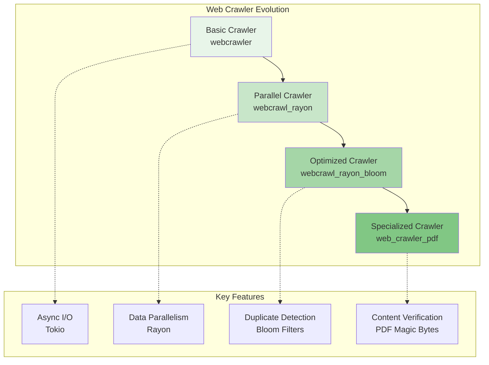

**Implementations:**
- `webcrawler`: Basic web crawler with domain filtering
- `webcrawl_rayon`: Parallel web crawler using Rayon for data parallelism
- `webcrawl_rayon_bloom`: Optimized crawler with Bloom filter for duplicate detection
- `web_crawler_pdf`: Specialized crawler for discovering and verifying PDF files
- `html_downloader`: Simple HTML content fetcher
- `hydra_mt`: Multi-threaded crawler with dynamic thread management

### File Operations

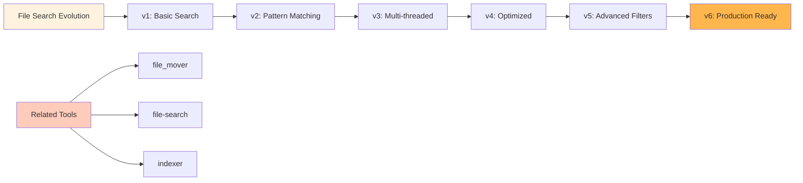

**Components:**
- `examples/file_search*.rs` (v1-v6): Evolution of file search utilities with increasing sophistication
- `file_mover/`: Utility for organizing and moving files
- `file-search/`: File search project directory
- `examples/sha2search.rs`: SHA-256 hash verification and search
- `indexer/`: File indexing system

### Network Programming

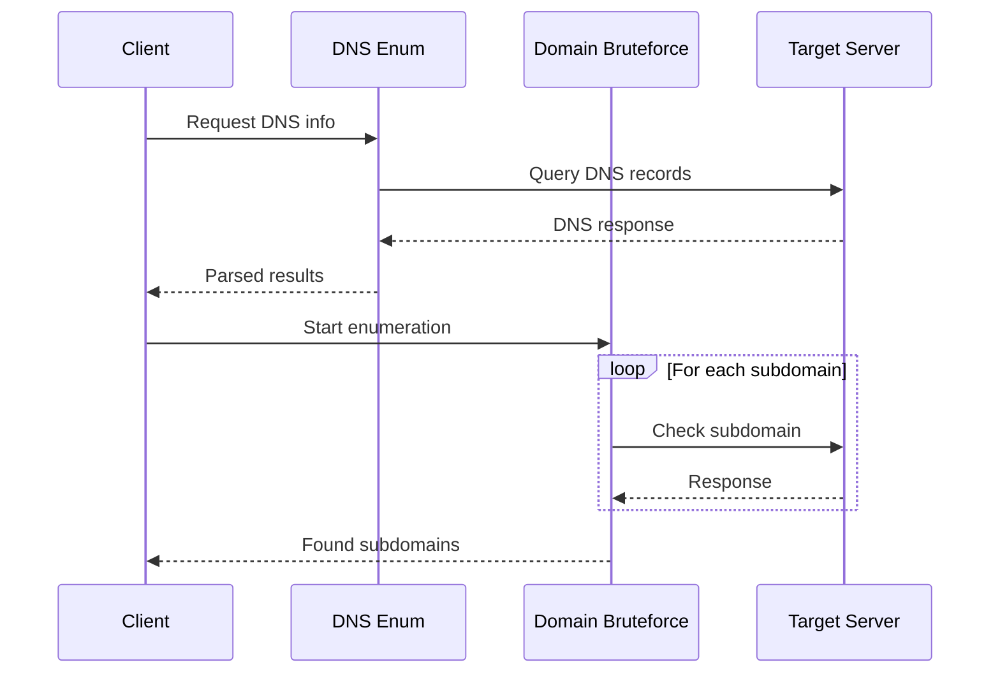

**Tools:**
- `examples/dns_enum.rs`: DNS enumeration utility
- `brute_force_domain_enum/`: Subdomain brute-forcing tool
- `tokio_tests/`: Async networking examples including TCP server

### Concurrent Processing

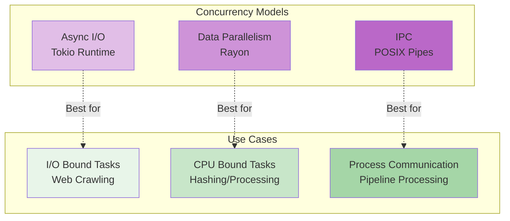

**Examples:**
- `rayon`: Parallel processing examples using Rayon
- `rayon_word`: Parallel word counting
- `rayon_hasher`: Multi-threaded file hashing
- `posix_pipe`: Inter-process communication using POSIX pipes

## Technology Stack

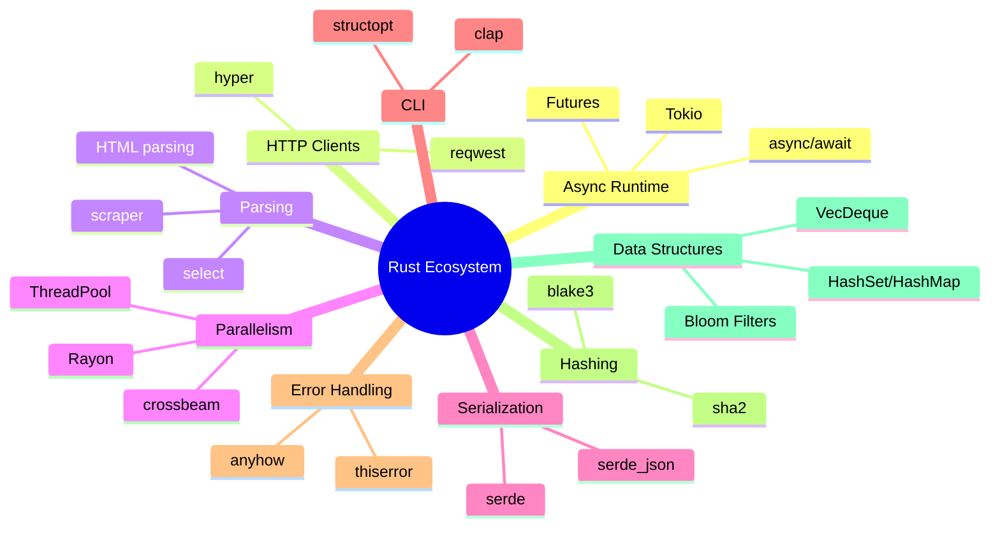

### Key Dependencies

| Crate | Purpose | Used In |
|-------|---------|---------|
| `tokio` | Async runtime | Web crawlers, network tools |
| `rayon` | Data parallelism | File processing, crawlers |
| `reqwest` | HTTP client | All web crawlers |
| `scraper` | HTML parsing | Web crawlers |
| `clap` | CLI parsing | Most utilities |
| `serde` | Serialization | PDF crawler, data output |
| `sha2` | Hashing | File verification |

## Getting Started

### Prerequisites

```bash
# Install Rust (if not already installed)
curl --proto '=https' --tlsv1.2 -sSf https://sh.rustup.rs | sh

# Update Rust to latest stable
rustup update stable
```

### Building Projects

Each project can be built independently:

```bash
# Navigate to a project directory
cd web_crawler_pdf

# Build in release mode for optimal performance
cargo build --release

# Run the program
cargo run --release -- [arguments]
```

### Example: Running the PDF Web Crawler

```bash
cd web_crawler_pdf
cargo run --release -- \
    --url "https://example.com" \
    --depth 3 \
    --concurrency 10 \
    --output pdfs.json \
    --verify
```

### Example: Running File Search

```bash
# For standalone .rs files in examples/
rustc examples/file_searchv6.rs
./file_searchv6 /path/to/search "*.txt"
```

## Architecture Patterns

### Web Crawler Architecture

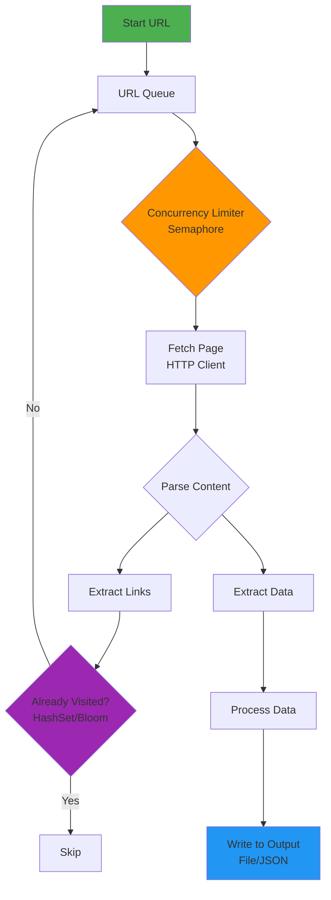

### Concurrent Processing Pipeline

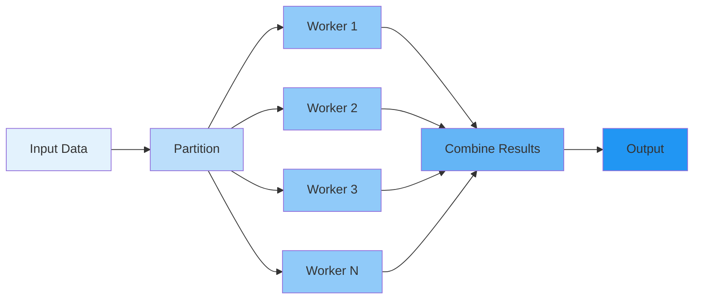

## Development Workflow

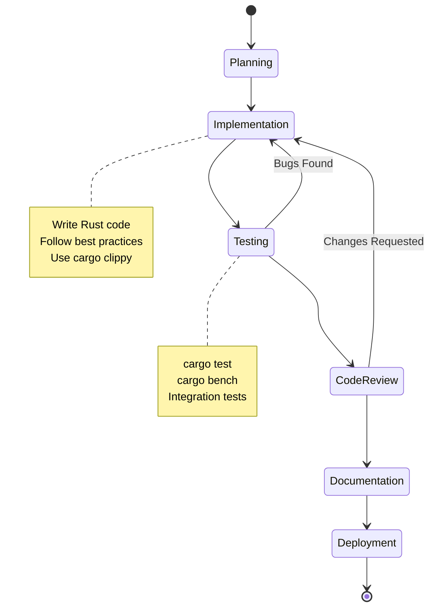

## Contributing

When contributing to this repository:

1. **Create a feature branch** with the format: `claude/feature-name-<session-id>`
2. **Follow Rust best practices**: Use `cargo fmt` and `cargo clippy`
3. **Add documentation**: Include README files for new projects
4. **Write tests**: Add unit and integration tests where applicable
5. **Update diagrams**: Keep architecture diagrams current

## License

See the [LICENSE](LICENSE) file for details.

## Resources

- [The Rust Programming Language Book](https://doc.rust-lang.org/book/)
- [Tokio Documentation](https://tokio.rs/)
- [Rayon Documentation](https://docs.rs/rayon/)
- [Rust by Example](https://doc.rust-lang.org/rust-by-example/)
