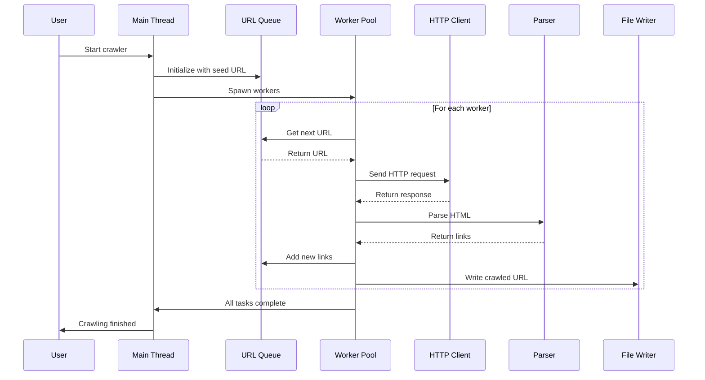

# Hydra MT - Multi-Threaded Web Crawler

[](https://www.rust-lang.org/)
[](LICENSE)
[]()
[]()

A collection of high-performance, concurrent web crawlers written in Rust. This project demonstrates various approaches to building scalable web crawlers using different Rust concurrency patterns and libraries.

## Features

- **Multiple Implementation Strategies**: From simple parallel crawlers to advanced async implementations
- **Concurrent Crawling**: Efficient multi-threaded URL processing
- **Configurable Depth**: Control crawl depth and domain restrictions
- **Error Handling**: Robust error handling with retry mechanisms
- **Logging**: Comprehensive logging with configurable levels
- **Domain Filtering**: Support for domain exclusion lists
- **Rate Limiting**: Configurable request timeouts and throttling
- **URL Normalization**: Proper handling of relative and absolute URLs

## Architecture


## Project Structure

```
hydra_mt/
├── README.md                     # This file
├── docs/                         # Documentation
│   ├── analysis.md              # Code analysis
│   ├── debugging.md             # Debugging guide
│   ├── gpt_implementation.md    # AI-assisted implementation
│   └── prompt_guide.md          # Development prompts
├── examples/                     # Example implementations
│   ├── basic_parallel/          # Simple parallel crawler (Rayon)
│   │   ├── Cargo.toml
│   │   └── src/
│   │       └── main.rs
│   ├── recursive_crawler/       # Recursive crawler with logging
│   │   ├── Cargo.toml
│   │   └── src/
│   │       └── main.rs
│   └── async_advanced/          # Advanced async crawler (Tokio)
│       ├── Cargo.toml
│       └── src/
│           └── main.rs
└── LICENSE
```

## Examples Overview

### 1. Basic Parallel Crawler (`basic_parallel`)

A straightforward implementation using Rayon for parallelism with blocking HTTP requests.

**Features:**
- Simple parallel processing using Rayon
- Blocking HTTP requests
- Basic URL extraction
- File output

**Use Case:** Best for small to medium crawling tasks with simple requirements.

```bash
cd examples/basic_parallel
cargo run --release
```

### 2. Recursive Crawler (`recursive_crawler`)

Enhanced crawler with depth control and comprehensive logging.

**Features:**
- Recursive crawling with depth limits
- Domain filtering (internal vs external)
- Comprehensive error logging
- Thread-safe URL management
- Parallel link processing

**Use Case:** Ideal for site mapping with controlled depth and detailed logging.

```bash
cd examples/recursive_crawler
cargo run --release
```

### 3. Advanced Async Crawler (`async_advanced`)

Production-grade async crawler using Tokio with advanced features.

**Features:**
- Fully asynchronous using Tokio runtime
- Dynamic thread pool management
- Automatic error-based throttling
- Request timeouts and retries
- RwLock for efficient concurrent access
- Configurable worker count
- Advanced URL normalization

**Use Case:** Large-scale crawling with thousands of concurrent requests.

```bash
cd examples/async_advanced
cargo run --release
```

## Crawl Flow Diagram



## Installation & Requirements

### Prerequisites

- **Rust 1.91 or higher**: Install from [rustup.rs](https://rustup.rs/)

```bash
curl --proto '=https' --tlsv1.2 -sSf https://sh.rustup.rs | sh
```

### Dependencies

All examples use modern, maintained crates:

- `tokio` - Async runtime (latest: 1.x)
- `reqwest` - HTTP client (latest: 0.12.x)
- `scraper` - HTML parsing (latest: 0.21.x)
- `rayon` - Data parallelism (latest: 1.x)
- `url` - URL parsing (latest: 2.x)
- `log` - Logging facade (latest: 0.4.x)
- `env_logger` - Logging implementation (latest: 0.11.x)

## Usage

### Basic Example

```rust
use rayon::prelude::*;
use reqwest::blocking::get;
use select::document::Document;
use select::predicate::Name;

fn main() -> Result<(), Box<dyn std::error::Error>> {
    let url = "https://example.com";
    let response = get(url)?;
    let document = Document::from_read(response)?;

    document.find(Name("a"))
        .filter_map(|n| n.attr("href"))
        .collect::<Vec<_>>()
        .par_iter()
        .for_each(|link| {
            println!("Found link: {}", link);
        });

    Ok(())
}
```

### Configuration

Each crawler can be configured through:

1. **User Input**: Interactive prompts for domain, output file, excluded domains
2. **Constants**: Modify constants in source code:

```rust
const MAX_PAGES_PER_DOMAIN: usize = 10000;
const NUM_THREADS: usize = 10;
const REQUEST_TIMEOUT_SECS: u64 = 10;
const MAX_DEPTH: usize = 5;
```

3. **Environment Variables**: Control logging level:

```bash
RUST_LOG=debug cargo run    # Detailed debug output
RUST_LOG=info cargo run     # Standard information
RUST_LOG=warn cargo run     # Warnings only
```

## Performance Comparison

| Implementation | Concurrency Model | Pages/sec* | Memory Usage* | Best For |
|----------------|-------------------|------------|---------------|----------|
| Basic Parallel | Rayon threads | ~50-100 | Low | Simple tasks |
| Recursive | Rayon + Depth | ~80-150 | Medium | Site mapping |
| Async Advanced | Tokio tasks | ~500-1000+ | Low-Medium | Large scale |

*Approximate values, depends on network and target server

## Concurrency Models


## Error Handling Strategy

The crawlers implement multiple layers of error handling:

1. **Network Errors**: Retry with exponential backoff
2. **Parse Errors**: Log and continue
3. **File I/O Errors**: Graceful degradation
4. **Timeout Handling**: Configurable timeouts
5. **Domain Validation**: Skip invalid URLs

## Best Practices

### Rate Limiting

```rust
// Add delays between requests to be respectful
tokio::time::sleep(Duration::from_millis(100)).await;
```

### Robots.txt Compliance

Consider implementing `robots.txt` parsing:

```rust
// Check robots.txt before crawling
if !is_allowed_by_robots(url) {
    return;
}
```

### User-Agent Headers

Always identify your crawler:

```rust
const USER_AGENT: &str = "HydraBot/1.0 (+https://github.com/yourusername/project)";
```

## Debugging

Enable debug logging to troubleshoot issues:

```bash
RUST_LOG=debug cargo run 2>&1 | tee crawler.log
```

Common issues and solutions:

- **Crawler stops early**: Check URL queue, ensure new URLs are being added
- **High error rates**: Increase timeout, reduce concurrency
- **Memory usage**: Limit queue size, process URLs in batches

## Development Workflow


## Building & Testing

```bash
# Format code
cargo fmt --all

# Run linter
cargo clippy --all-targets --all-features

# Build all examples
cd examples/basic_parallel && cargo build --release
cd ../recursive_crawler && cargo build --release
cd ../async_advanced && cargo build --release

# Run tests
cargo test --all

# Build with optimizations
cargo build --release
```

## Contributing

Contributions are welcome! Please:

1. Fork the repository
2. Create a feature branch
3. Make your changes
4. Run `cargo fmt` and `cargo clippy`
5. Submit a pull request

## License

This project is licensed under the MIT License - see the LICENSE file for details.

## Acknowledgments

- Built with Rust's excellent ecosystem
- Inspired by various web crawling frameworks
- Community contributions and feedback

## Related Projects

- [Scrapy](https://scrapy.org/) - Python web crawling framework
- [Colly](https://go-colly.org/) - Go web scraping framework
- [Spider](https://github.com/spider-rs/spider) - Rust web crawler

## Support

For questions or issues:
- Open an issue on GitHub
- Check existing documentation in `/docs`
- Review example implementations

## Roadmap

- [ ] Add robots.txt parsing
- [ ] Implement sitemap.xml support
- [ ] Add JavaScript rendering (headless browser)
- [ ] Distributed crawling support
- [ ] REST API interface
- [ ] Web UI for monitoring
- [ ] Database storage backend
- [ ] Content extraction pipelines
- [ ] Custom plugin system

---

**Made with Rust** 🦀
