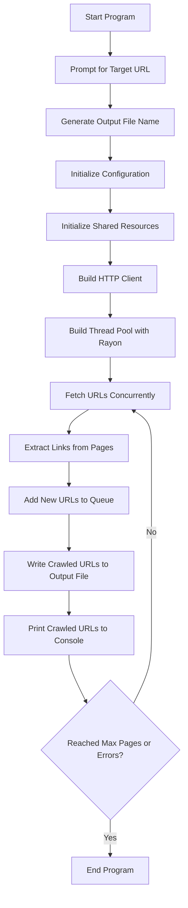

Sure! Here is a `README.md` file that explains how the Rust program functions, along with a Mermaid diagram illustrating the program's workflow.

### README.md

```markdown
# Web Crawler

This is a Rust-based web crawler that uses the Rayon crate for parallelism. The crawler fetches web pages concurrently, extracts URLs from fetched pages, and handles errors gracefully. The program respects the politeness policy by avoiding overwhelming the server.

## Features

- Concurrent fetching of web pages using Rayon
- URL extraction from fetched pages
- Retry logic and error handling
- Customizable user-agent, timeout, retries, threads, and error threshold
- Generates output file name based on the target URL and current date/time
- Prints crawled URLs to the console

## Installation

1. Clone the repository:
    ```sh
    git clone https://github.com/yourusername/web_crawler.git
    cd web_crawler
    ```

2. Build the project:
    ```sh
    cargo build
    ```

## Usage

1. Run the project:
    ```sh
    cargo run
    ```

2. When prompted, enter the target URL. The program will automatically generate a file name based on the URL and the current date/time.

## Example

```sh
$ cargo run
Please enter the target URL: www.example.com
Output file will be: www_example_com_20230726103000.txt
```

The program will then start crawling the specified URL and print each crawled URL to the console.

## Configuration

The following configuration options can be set via the `Config` struct in `src/main.rs`:

- `domain`: The target URL to crawl.
- `output`: The output file name.
- `timeout`: Request timeout in seconds.
- `retries`: Number of retry attempts for failed requests.
- `threads`: Number of concurrent threads to use.
- `error_threshold`: Maximum number of errors before stopping.
- `user_agent`: User-agent string for HTTP requests.

## Workflow



## Dependencies

- `reqwest`: For making HTTP requests.
- `scraper`: For parsing HTML and extracting URLs.
- `url`: For URL manipulation.
- `rayon`: For parallel processing.
- `serde`: For serializing and deserializing data.
- `serde_json`: For working with JSON data.
- `structopt`: For parsing command-line arguments.
- `log`: For logging.
- `env_logger`: For configuring logging.
- `chrono`: For date and time handling.

## License

This project is licensed under the MIT License. See the [LICENSE](LICENSE) file for details.
```

### Explanation

The `README.md` file provides a comprehensive overview of the web crawler program, including installation instructions, usage examples, configuration options, and a workflow diagram using Mermaid.

### Mermaid Diagram

The Mermaid diagram visualizes the program's workflow, showing the sequence of steps from starting the program to ending it. This helps users understand how the program functions internally.

You can now include this `README.md` in your Git repository to document the web crawler project effectively.
