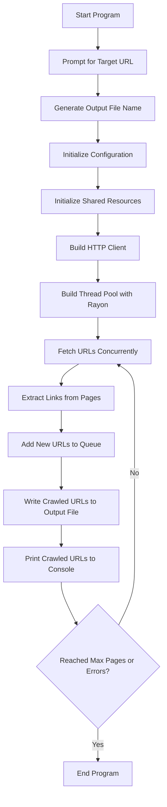

```markdown
# Web Crawler

This is a Rust-based web crawler that uses the Rayon crate for parallelism. The crawler fetches web pages concurrently, extracts URLs from fetched pages, and handles errors gracefully. The program respects the politeness policy by avoiding overwhelming the server.

## Features

- Concurrent fetching of web pages using Rayon
- URL extraction from fetched pages
- Retry logic and error handling
- Customizable user-agent, timeout, retries, threads, and error threshold
- Generates output file name based on the target URL and current date/time
- Prints crawled URLs to the console

## Installation

1. Clone the repository:
    ```sh
    git clone https://github.com/yourusername/web_crawler.git
    cd web_crawler
    ```

2. Build the project:
    ```sh
    cargo build
    ```

## Usage

1. Run the project:
    ```sh
    cargo run
    ```

2. When prompted, enter the target URL. The program will automatically generate a file name based on the URL and the current date/time.

## Example

```sh
$ cargo run
Please enter the target URL: www.example.com
Output file will be: www_example_com_20230726103000.txt
```

The program will then start crawling the specified URL and print each crawled URL to the console.

## Configuration

The following configuration options can be set via the `Config` struct in `src/main.rs`:

- `domain`: The target URL to crawl.
- `output`: The output file name.
- `timeout`: Request timeout in seconds.
- `retries`: Number of retry attempts for failed requests.
- `threads`: Number of concurrent threads to use.
- `error_threshold`: Maximum number of errors before stopping.
- `user_agent`: User-agent string for HTTP requests.

## Workflow



## Dependencies

- `reqwest`: For making HTTP requests.
- `scraper`: For parsing HTML and extracting URLs.
- `url`: For URL manipulation.
- `rayon`: For parallel processing.
- `serde`: For serializing and deserializing data.
- `serde_json`: For working with JSON data.
- `structopt`: For parsing command-line arguments.
- `log`: For logging.
- `env_logger`: For configuring logging.
- `chrono`: For date and time handling.

## License

This project is licensed under the MIT License. See the [LICENSE](LICENSE) file for details.
```

### Explanation

The `README.md` file provides a comprehensive overview of the web crawler program, including installation instructions, usage examples, configuration options, and a workflow diagram using Mermaid.

### Mermaid Diagram

The Mermaid diagram visualizes the program's workflow, showing the sequence of steps from starting the program to ending it. This helps users understand how the program functions internally.

You can now include this `README.md` in your Git repository to document the web crawler project effectively.

In the `crawler.rs` implementation, the program ensures that URLs which have already been crawled are not crawled again by using a `HashSet` to track crawled URLs. Here's a step-by-step explanation of how this is achieved:

1. **Initialization of `crawled_urls`:**
   - At the beginning of the `run` function, an `Arc<Mutex<HashSet<String>>>` is created to store the crawled URLs. This ensures that the set can be safely shared and modified across multiple threads.

    ```rust
    let crawled_urls = Arc::new(Mutex::new(HashSet::new()));
    ```

2. **Checking if a URL has been crawled:**
   - Before processing a URL, the program checks if the URL is already present in the `crawled_urls` set. If it is, the program skips the URL to avoid duplication.

    ```rust
    if crawled_urls.lock().unwrap().contains(url) {
        return;
    }
    ```

3. **Adding a crawled URL to the set:**
   - After successfully processing a URL, the program adds the URL to the `crawled_urls` set. This ensures that the URL will be recognized as already crawled in future iterations.

    ```rust
    let mut crawled_urls = crawled_urls.lock().unwrap();
    crawled_urls.insert(url.clone());
    ```

Here’s the relevant portion of the `crawler.rs` code that demonstrates these steps:

```rust
use rayon::prelude::*;
use reqwest::blocking::Client;
use scraper::{Html, Selector};
use std::collections::{HashMap, HashSet, VecDeque};
use std::io::Write;
use std::sync::{Arc, Mutex, atomic::{AtomicUsize, Ordering}};
use std::time::Duration;
use std::fs::OpenOptions;
use url::Url;
use log::error;
use structopt::StructOpt;

const MAX_PAGES_PER_DOMAIN: usize = 568210;
const RETRY_DELAY: Duration = Duration::from_secs(2);

#[derive(StructOpt, Debug)]
pub struct Config {
    #[structopt(long)]
    pub domain: String,

    #[structopt(long)]
    pub output: String,

    #[structopt(long)]
    pub timeout: u64,

    #[structopt(long)]
    pub retries: usize,

    #[structopt(long)]
    pub threads: usize,

    #[structopt(long)]
    pub error_threshold: usize,

    #[structopt(long)]
    pub user_agent: String,
}

pub fn run(config: Config) -> Result<(), Box<dyn std::error::Error>> {
    let error_count = Arc::new(AtomicUsize::new(0));

    let starting_url = format!("https://{}", config.domain);
    let crawled_urls = Arc::new(Mutex::new(HashSet::new()));
    let num_pages_crawled = Arc::new(AtomicUsize::new(0));
    let urls_to_crawl = Arc::new(Mutex::new(HashMap::new()));

    urls_to_crawl.lock().unwrap().entry(config.domain.clone()).or_insert_with(VecDeque::new).push_back(starting_url.clone());

    let client = Client::builder()
        .user_agent(&config.user_agent)
        .timeout(Duration::from_secs(config.timeout))
        .build()?;

    rayon::ThreadPoolBuilder::new().num_threads(config.threads).build_global()?;

    loop {
        let urls: Vec<(String, String)> = {
            let mut urls_to_crawl = urls_to_crawl.lock().unwrap();
            urls_to_crawl.iter_mut()
                .flat_map(|(domain, urls)| urls.drain(..).map(move |url| (domain.clone(), url)))
                .collect()
        };

        if urls.is_empty() {
            break;
        }

        urls.par_iter().for_each(|(domain, url)| {
            if crawled_urls.lock().unwrap().contains(url) {
                return;
            }

            for attempt in 1..=config.retries {
                match client.get(url).send() {
                    Ok(res) => {
                        if res.status().is_success() {
                            let content = match res.text() {
                                Ok(text) => text,
                                Err(err) => {
                                    error!("Error reading response text for URL {}: {}", url, err);
                                    return;
                                }
                            };

                            let mut new_urls = Vec::new();
                            let fragment = Html::parse_document(&content);
                            let selector = Selector::parse("a").unwrap();

                            for element in fragment.select(&selector) {
                                if let Some(new_url) = element.value().attr("href") {
                                    let resolved_url = if new_url.starts_with("http") || new_url.starts_with("https") {
                                        new_url.to_string()
                                    } else {
                                        match Url::parse(url) {
                                            Ok(base) => match base.join(new_url) {
                                                Ok(resolved) => resolved.to_string(),
                                                Err(err) => {
                                                    error!("Error resolving URL {}: {}", new_url, err);
                                                    continue;
                                                }
                                            },
                                            Err(err) => {
                                                error!("Error parsing base URL {}: {}", url, err);
                                                continue;
                                            }
                                        }
                                    };
                                    new_urls.push(resolved_url);
                                }
                            }

                            {
                                let mut urls_to_crawl = urls_to_crawl.lock().unwrap();
                                for new_url in new_urls {
                                    urls_to_crawl.entry(domain.clone()).or_default().push_back(new_url);
                                }
                            }

                            {
                                let mut crawled_urls = crawled_urls.lock().unwrap();
                                crawled_urls.insert(url.clone());
                            }

                            {
                                let mut file = OpenOptions::new()
                                    .write(true)
                                    .create(true)
                                    .append(true)
                                    .open(&config.output)
                                    .unwrap();
                                writeln!(file, "{}", &url).unwrap();
                            }

                            // Output the crawled URL to the console
                            println!("Crawled URL: {}", url);

                            num_pages_crawled.fetch_add(1, Ordering::Relaxed);
                            break; // Exit retry loop on success
                        }
                    }
                    Err(err) => {
                        error!("Request error for URL {}: {} (Attempt {}/{})", url, err, attempt, config.retries);
                        if attempt == config.retries {
                            error!("Giving up on URL {} after {} attempts", url, config.retries);
                        } else {
                            std::thread::sleep(RETRY_DELAY);
                        }
                    }
                }
            }
        });

        if num_pages_crawled.load(Ordering::Relaxed) >= MAX_PAGES_PER_DOMAIN {
            break;
        }

        let curr_error_count = error_count.load(Ordering::Relaxed);
        if curr_error_count >= config.error_threshold {
            break;
        }
    }

    Ok(())
}
```

### Summary

1. **Initialization of `crawled_urls`:** A thread-safe `HashSet` wrapped in an `Arc` and `Mutex` is used to store the URLs that have been crawled.
2. **Checking for Duplicates:** Before processing a URL, the program checks if it is already in the `crawled_urls` set and skips it if it is.
3. **Adding Crawled URLs:** After processing a URL, the program adds it to the `crawled_urls` set to ensure it won't be processed again.

By using these mechanisms, the program ensures that URLs are not crawled more than once, avoiding unnecessary duplicate work and potential infinite loops.
