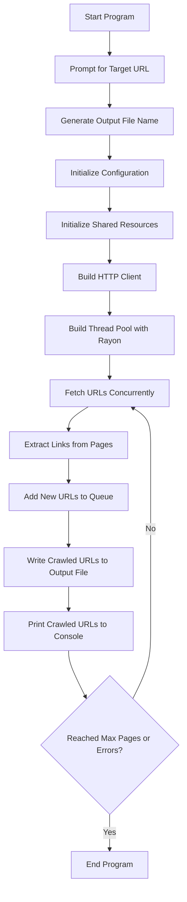

```markdown
# Web Crawler with Bloom Filter

This Rust-based web crawler uses the Rayon crate for parallelism and a Bloom filter for efficient URL deduplication. The crawler fetches web pages concurrently, extracts URLs from the fetched pages, and handles errors gracefully. It respects the politeness policy by avoiding overwhelming the server.

## Features

- Concurrent fetching of web pages using Rayon
- URL extraction from fetched pages
- Efficient URL deduplication using a Bloom filter
- Retry logic and error handling
- Customizable user-agent, timeout, retries, threads, and error threshold
- Generates an output file name based on the target URL and current date/time
- Prints crawled URLs to the console

## Installation

1. Clone the repository:
    ```sh
    git clone https://github.com/yourusername/web_crawler.git
    cd web_crawler
    ```

2. Build the project:
    ```sh
    cargo build
    ```

## Usage

1. Run the project:
    ```sh
    cargo run
    ```

2. When prompted, enter the target URL. The program will automatically generate a file name based on the URL and the current date/time.

## Example

```sh
$ cargo run
Please enter the target URL: https://example.com
Output file will be: example_com_20240726162745.txt
Crawled URL: https://example.com/page1
Crawled URL: https://example.com/page2
...
```

## Configuration

The following configuration options can be set via the `Config` struct in `src/main.rs`:

- `domain`: The target URL to crawl.
- `output`: The output file name.
- `timeout`: Request timeout in seconds.
- `retries`: Number of retry attempts for failed requests.
- `threads`: Number of concurrent threads to use.
- `error_threshold`: Maximum number of errors before stopping.
- `user_agent`: User-agent string for HTTP requests.

## Workflow



## Dependencies

- `reqwest`: For making HTTP requests.
- `scraper`: For parsing HTML and extracting URLs.
- `url`: For URL manipulation.
- `rayon`: For parallel processing.
- `serde`: For serializing and deserializing data.
- `serde_json`: For working with JSON data.
- `structopt`: For parsing command-line arguments.
- `log`: For logging.
- `env_logger`: For configuring logging.
- `chrono`: For date and time handling.
- `bloom`: For efficient URL deduplication.

## License

This project is licensed under the MIT License. See the [LICENSE](LICENSE) file for details.
```

### Explanation

1. **Introduction:**
   - Provides an overview of the web crawler's features and purpose.

2. **Installation:**
   - Instructions for cloning the repository and building the project.

3. **Usage:**
   - Steps to run the project and an example of what the output looks like.

4. **Configuration:**
   - Lists the configurable parameters and their descriptions.

5. **Workflow Diagram:**
   - A Mermaid diagram to visualize the workflow of the crawler.

6. **Dependencies:**
   - Lists the external crates used in the project.

7. **License:**
   - Mentions the license under which the project is distributed.

This `README.md` file provides a comprehensive guide to understanding, configuring, and using the web crawler, making it easy for others to use and contribute to the project.


When crawling millions of pages, the scalability and performance of the `crawled_urls` set are crucial. Using a `HashSet` is straightforward, but there are more performant and scalable options:

1. **Bloom Filter**: A probabilistic data structure that can efficiently test whether an element is in a set. It can reduce memory usage significantly but introduces a small probability of false positives.

2. **Disk-based Storage**: Using a disk-based database (e.g., RocksDB, LMDB) to store crawled URLs can handle larger datasets than in-memory structures.

3. **HyperLogLog**: Another probabilistic data structure that can provide efficient cardinality estimation but with a higher complexity for our use case compared to Bloom filters.

### Bloom Filter

A Bloom filter is an efficient way to handle large sets with a small memory footprint, but it cannot remove items (only add). It is suitable for the URL deduplication problem because it provides fast membership checking with a small error rate.

#### Adding a Bloom Filter to Our Crawler

We'll use the `bloom` crate to implement a Bloom filter.

### Cargo.toml

Add the `bloom` crate to your dependencies:

```toml
[package]
name = "web_crawler"
version = "0.1.0"
edition = "2018"

[dependencies]
reqwest = { version = "0.11", features = ["blocking"] }
scraper = "0.12"
url = "2"
rayon = "1.5"
serde = { version = "1.0", features = ["derive"] }
serde_json = "1.0"
structopt = "0.3"
log = "0.4"
env_logger = "0.9"
chrono = "0.4"
bloom = "1.1"
```

### src/crawler.rs

Update `crawler.rs` to use a Bloom filter for tracking crawled URLs.

```rust
use rayon::prelude::*;
use reqwest::blocking::Client;
use scraper::{Html, Selector};
use std::collections::{HashMap, VecDeque};
use std::io::Write;
use std::sync::{Arc, Mutex, atomic::{AtomicUsize, Ordering}};
use std::time::Duration;
use std::fs::OpenOptions;
use url::Url;
use log::error;
use structopt::StructOpt;
use bloom::BloomFilter;

const MAX_PAGES_PER_DOMAIN: usize = 568210;
const RETRY_DELAY: Duration = Duration::from_secs(2);

#[derive(StructOpt, Debug)]
pub struct Config {
    #[structopt(long)]
    pub domain: String,

    #[structopt(long)]
    pub output: String,

    #[structopt(long)]
    pub timeout: u64,

    #[structopt(long)]
    pub retries: usize,

    #[structopt(long)]
    pub threads: usize,

    #[structopt(long)]
    pub error_threshold: usize,

    #[structopt(long)]
    pub user_agent: String,
}

pub fn run(config: Config) -> Result<(), Box<dyn std::error::Error>> {
    let error_count = Arc::new(AtomicUsize::new(0));

    let starting_url = format!("https://{}", config.domain);
    let crawled_urls = Arc::new(Mutex::new(BloomFilter::with_rate(0.01, 100_000_000)));
    let num_pages_crawled = Arc::new(AtomicUsize::new(0));
    let urls_to_crawl = Arc::new(Mutex::new(HashMap::new()));

    urls_to_crawl.lock().unwrap().entry(config.domain.clone()).or_insert_with(VecDeque::new).push_back(starting_url.clone());

    let client = Client::builder()
        .user_agent(&config.user_agent)
        .timeout(Duration::from_secs(config.timeout))
        .build()?;

    rayon::ThreadPoolBuilder::new().num_threads(config.threads).build_global()?;

    loop {
        let urls: Vec<(String, String)> = {
            let mut urls_to_crawl = urls_to_crawl.lock().unwrap();
            urls_to_crawl.iter_mut()
                .flat_map(|(domain, urls)| urls.drain(..).map(move |url| (domain.clone(), url)))
                .collect()
        };

        if urls.is_empty() {
            break;
        }

        urls.par_iter().for_each(|(domain, url)| {
            let mut crawled_urls = crawled_urls.lock().unwrap();
            if crawled_urls.contains(url) {
                return;
            }

            for attempt in 1..=config.retries {
                match client.get(url).send() {
                    Ok(res) => {
                        if res.status().is_success() {
                            let content = match res.text() {
                                Ok(text) => text,
                                Err(err) => {
                                    error!("Error reading response text for URL {}: {}", url, err);
                                    return;
                                }
                            };

                            let mut new_urls = Vec::new();
                            let fragment = Html::parse_document(&content);
                            let selector = Selector::parse("a").unwrap();

                            for element in fragment.select(&selector) {
                                if let Some(new_url) = element.value().attr("href") {
                                    let resolved_url = if new_url.starts_with("http") || new_url.starts_with("https") {
                                        new_url.to_string()
                                    } else {
                                        match Url::parse(url) {
                                            Ok(base) => match base.join(new_url) {
                                                Ok(resolved) => resolved.to_string(),
                                                Err(err) => {
                                                    error!("Error resolving URL {}: {}", new_url, err);
                                                    continue;
                                                }
                                            },
                                            Err(err) => {
                                                error!("Error parsing base URL {}: {}", url, err);
                                                continue;
                                            }
                                        }
                                    };
                                    new_urls.push(resolved_url);
                                }
                            }

                            {
                                let mut urls_to_crawl = urls_to_crawl.lock().unwrap();
                                for new_url in new_urls {
                                    urls_to_crawl.entry(domain.clone()).or_default().push_back(new_url);
                                }
                            }

                            {
                                crawled_urls.insert(url);
                            }

                            {
                                let mut file = OpenOptions::new()
                                    .write(true)
                                    .create(true)
                                    .append(true)
                                    .open(&config.output)
                                    .unwrap();
                                writeln!(file, "{}", &url).unwrap();
                            }

                            // Output the crawled URL to the console
                            println!("Crawled URL: {}", url);

                            num_pages_crawled.fetch_add(1, Ordering::Relaxed);
                            break; // Exit retry loop on success
                        }
                    }
                    Err(err) => {
                        error!("Request error for URL {}: {} (Attempt {}/{})", url, err, attempt, config.retries);
                        if attempt == config.retries {
                            error!("Giving up on URL {} after {} attempts", url, config.retries);
                        } else {
                            std::thread::sleep(RETRY_DELAY);
                        }
                    }
                }
            }
        });

        if num_pages_crawled.load(Ordering::Relaxed) >= MAX_PAGES_PER_DOMAIN {
            break;
        }

        let curr_error_count = error_count.load(Ordering::Relaxed);
        if curr_error_count >= config.error_threshold {
            break;
        }
    }

    Ok(())
}
```

### Explanation

1. **Bloom Filter Initialization:**
   - The `crawled_urls` is now a `BloomFilter` with a false positive rate of 0.01 and an initial size for 100 million elements. This allows efficient membership checks with a low memory footprint.
   
    ```rust
    let crawled_urls = Arc::new(Mutex::new(BloomFilter::with_rate(0.01, 100_000_000)));
    ```

2. **Checking for Crawled URLs:**
   - Before processing a URL, the program checks if it is already present in the `BloomFilter`. If it is, the program skips the URL to avoid duplication.
   
    ```rust
    let mut crawled_urls = crawled_urls.lock().unwrap();
    if crawled_urls.contains(url) {
        return;
    }
    ```

3. **Adding Crawled URLs:**
   - After successfully processing a URL, the program adds the URL to the `BloomFilter`. This ensures that the URL will be recognized as already crawled in future iterations.
   
    ```rust
    crawled_urls.insert(url);
    ```

### Advantages of Using a Bloom Filter

- **Memory Efficiency:** A Bloom filter uses significantly less memory than a `HashSet` when tracking a large number of URLs.
- **Speed:** Bloom filters provide constant-time complexity for insertions and membership checks, making them very fast.
- **Scalability:** Bloom filters can handle millions of entries with a low false-positive rate, making them suitable for large-scale web crawling.

### Considerations

- **False Positives:** A Bloom filter may yield false positives, meaning it might incorrectly indicate that a URL has been crawled when it hasn't. This is acceptable in many web crawling scenarios as it only results in skipping some URLs unnecessarily.
- **No Deletions:** Bloom filters do not support deletions. Once a URL is added, it cannot be removed. This is suitable for our use case where we only add and check URLs.

By using a Bloom filter, we can improve the scalability and performance of the web crawler, making it capable of handling millions of URLs efficiently.
