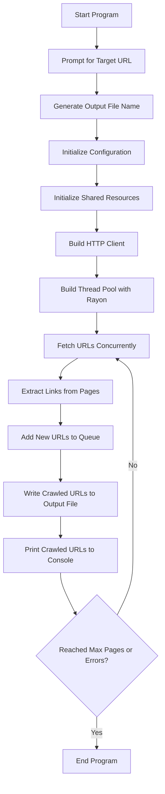

Sure! Here's a comprehensive `README.md` for the Bloom Filter-based web crawler.

### README.md

```markdown
# Web Crawler with Bloom Filter

This Rust-based web crawler uses the Rayon crate for parallelism and a Bloom filter for efficient URL deduplication. The crawler fetches web pages concurrently, extracts URLs from the fetched pages, and handles errors gracefully. It respects the politeness policy by avoiding overwhelming the server.

## Features

- Concurrent fetching of web pages using Rayon
- URL extraction from fetched pages
- Efficient URL deduplication using a Bloom filter
- Retry logic and error handling
- Customizable user-agent, timeout, retries, threads, and error threshold
- Generates an output file name based on the target URL and current date/time
- Prints crawled URLs to the console

## Installation

1. Clone the repository:
    ```sh
    git clone https://github.com/yourusername/web_crawler.git
    cd web_crawler
    ```

2. Build the project:
    ```sh
    cargo build
    ```

## Usage

1. Run the project:
    ```sh
    cargo run
    ```

2. When prompted, enter the target URL. The program will automatically generate a file name based on the URL and the current date/time.

## Example

```sh
$ cargo run
Please enter the target URL: https://example.com
Output file will be: example_com_20240726162745.txt
Crawled URL: https://example.com/page1
Crawled URL: https://example.com/page2
...
```

## Configuration

The following configuration options can be set via the `Config` struct in `src/main.rs`:

- `domain`: The target URL to crawl.
- `output`: The output file name.
- `timeout`: Request timeout in seconds.
- `retries`: Number of retry attempts for failed requests.
- `threads`: Number of concurrent threads to use.
- `error_threshold`: Maximum number of errors before stopping.
- `user_agent`: User-agent string for HTTP requests.

## Workflow



## Dependencies

- `reqwest`: For making HTTP requests.
- `scraper`: For parsing HTML and extracting URLs.
- `url`: For URL manipulation.
- `rayon`: For parallel processing.
- `serde`: For serializing and deserializing data.
- `serde_json`: For working with JSON data.
- `structopt`: For parsing command-line arguments.
- `log`: For logging.
- `env_logger`: For configuring logging.
- `chrono`: For date and time handling.
- `bloom`: For efficient URL deduplication.

## License

This project is licensed under the MIT License. See the [LICENSE](LICENSE) file for details.
```

### Explanation

1. **Introduction:**
   - Provides an overview of the web crawler's features and purpose.

2. **Installation:**
   - Instructions for cloning the repository and building the project.

3. **Usage:**
   - Steps to run the project and an example of what the output looks like.

4. **Configuration:**
   - Lists the configurable parameters and their descriptions.

5. **Workflow Diagram:**
   - A Mermaid diagram to visualize the workflow of the crawler.

6. **Dependencies:**
   - Lists the external crates used in the project.

7. **License:**
   - Mentions the license under which the project is distributed.

This `README.md` file provides a comprehensive guide to understanding, configuring, and using the web crawler, making it easy for others to use and contribute to the project.
