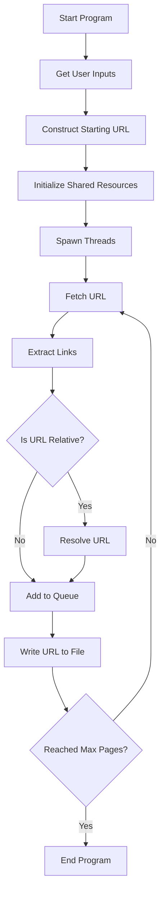

Certainly! Below is the `README.md` file for your web crawler, including a detailed explanation of its functionality and a Mermaid diagram representing its operation.

### README.md

```markdown
# Web Crawler

This project is a multi-threaded web crawler written in Rust. It uses asynchronous programming with Tokio to efficiently crawl web pages, extract URLs, and save the results to a file. The crawler ensures that all URLs are absolute and handles relative URLs appropriately.

## Features

- Multi-threaded crawling with Tokio
- Asynchronous I/O operations
- Handles relative URLs by resolving them against the base URL
- User-agent customization
- Error handling and retry mechanism
- Configurable parameters for threads and timeout

## Dependencies

- `reqwest`: For making HTTP requests
- `scraper`: For parsing HTML
- `tokio`: For asynchronous programming
- `url`: For URL parsing and resolution

## Setup

### Prerequisites

- Rust and Cargo installed
- Internet access for HTTP requests

### Installation

1. Clone the repository:
    ```bash
    git clone https://github.com/yourusername/web_crawler.git
    cd web_crawler
    ```

2. Update dependencies in `Cargo.toml`:
    ```toml
    [dependencies]
    reqwest = { version = "0.11", features = ["json", "stream"] }
    scraper = "0.12"
    tokio = { version = "1", features = ["full"] }
    url = "2"
    ```

3. Build the project:
    ```bash
    cargo build
    ```

4. Run the project:
    ```bash
    cargo run
    ```

## Usage

When you run the program, it will prompt you for the following inputs:

1. **Domain to begin crawling:** Enter the domain (e.g., `example.com`).
2. **File name to write the crawled results:** Enter the desired output file name (e.g., `results.txt`).
3. **Domains to be excluded (comma-separated):** Enter domains to be excluded from crawling, separated by commas (e.g., `exclude1.com,exclude2.com`).

### Example

```bash
Please enter the domain to begin crawling: example.com
Please enter the file name to write the crawled results: results.txt
Please enter the domains to be excluded (comma-separated): exclude1.com,exclude2.com
```

## How It Works

1. **Initialization:** 
   - The program initializes shared atomic counters and mutexes for thread synchronization.
   - The user inputs are collected and processed.

2. **Starting URL:**
   - The starting URL is constructed from the given domain.

3. **Crawling Process:**
   - The program spawns multiple threads to crawl URLs concurrently.
   - Each thread fetches a URL, extracts links, resolves relative URLs, and adds new URLs to the crawl queue.
   - Crawled URLs are written to the specified output file.

4. **Error Handling:**
   - The program logs and retries failed requests based on the configured error threshold.

### Mermaid Diagram



## Contribution

Feel free to fork this repository and submit pull requests. For major changes, please open an issue first to discuss what you would like to change.

## License

This project is licensed under the MIT License.
```

### Diagram Explanation

The Mermaid diagram visually represents the flow of operations within the web crawler:

- **Start Program:** The entry point where the program begins.
- **Get User Inputs:** The program prompts the user for input.
- **Construct Starting URL:** The program constructs the starting URL based on user input.
- **Initialize Shared Resources:** Shared resources like atomic counters and mutexes are initialized.
- **Spawn Threads:** Multiple threads are spawned to handle the crawling process.
- **Fetch URL:** Each thread fetches a URL.
- **Extract Links:** Links are extracted from the fetched page.
- **Is URL Relative?:** The program checks if the URL is relative.
  - **Yes:** Resolve the relative URL against the base URL.
  - **No:** Directly add the URL to the crawl queue.
- **Add to Queue:** The URL is added to the crawl queue.
- **Write URL to File:** The crawled URL is written to the output file.
- **Reached Max Pages?:** The program checks if the maximum number of pages per domain has been reached.
  - **No:** The program continues fetching URLs.
  - **Yes:** The program ends.

This `README.md` file provides a comprehensive guide to understanding, setting up, and running your web crawler project, along with a visual representation of its operation.
